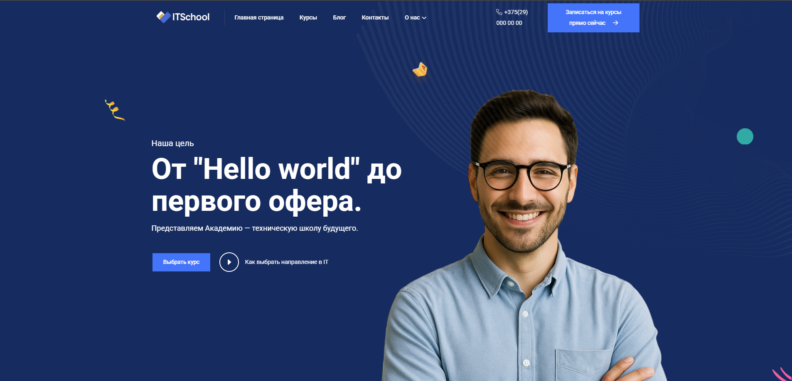
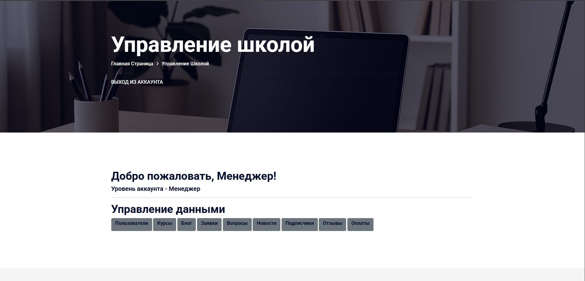
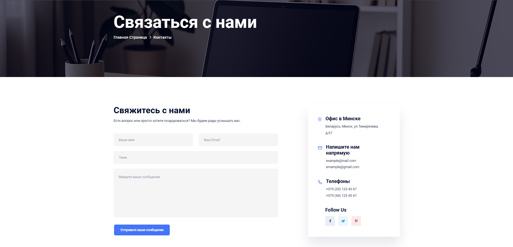
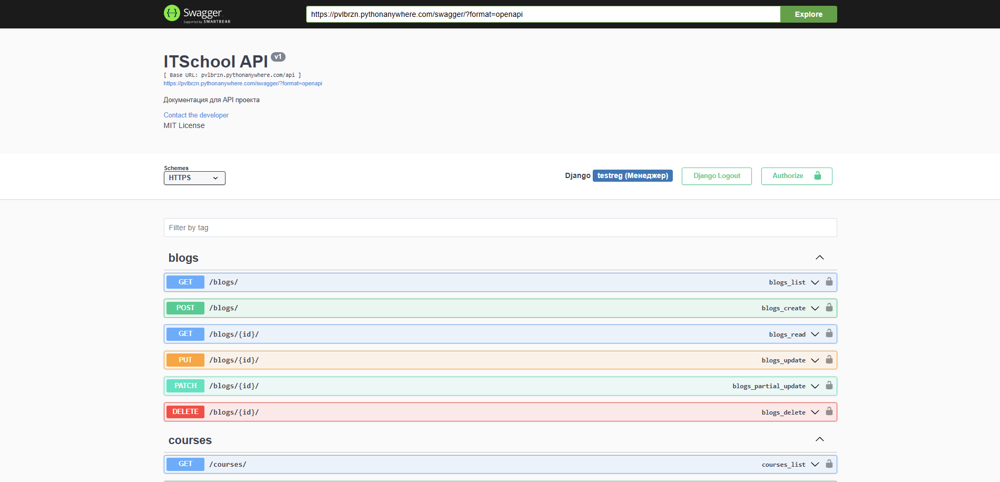
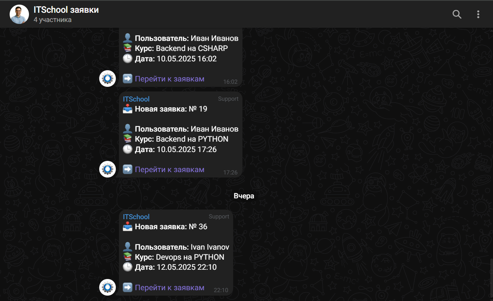

# 🎓 IT School Platform

A full-featured web platform for managing an online IT school, built with Django and Django REST Framework.

🔗 **Live site:** [https://pvlbrzn.pythonanywhere.com/](https://pvlbrzn.pythonanywhere.com/)  
📁 **GitHub repo:** [https://github.com/pvlbrzn/ITSchool](https://github.com/pvlbrzn/ITSchool)

## 🚀 Features

- 🧠 Course catalog: users can browse, register, and pay for courses.
- 👤 User roles: student (default), teacher, and manager.
- 📨 Email confirmation and newsletter subscription via Google SMTP.
- ⏱ Scheduled tasks using Celery + Redis + django-celery-beat.
- 📲 Telegram notifications for managers when a student enrolls.
- 🛠 Custom manager panel: full CRUD for users, courses, lessons.
- 🧪 Management commands to generate fake users, courses, and lessons.
- 🌍 Dynamic blog + FAQ parsing from [https://teachmeskills.by/](https://teachmeskills.by/) using Playwright.
- 📄 Swagger UI for interactive API documentation.
- 📱 Fully responsive with mobile layout and burger menus.
- 🐳 Dockerized for quick and easy deployment.

## 🛠️ Tech Stack

- Python 3.8+
- Django
- Django REST Framework
- Celery + Redis
- django-celery-beat
- Playwright
- drf-yasg (Swagger docs)
- Docker + Docker Compose
- Telegram Bot API
- Bootstrap

## 🐳 Quick Start with Docker

Make sure you have Docker and Docker Compose installed.

```bash
git clone https://github.com/pvlbrzn/ITSchool.git
cd ITSchool

# Copy environment template and update values
cp .env.example .env

# Build and run the app
docker-compose up --build
```

After containers are up, access the site at:
http://localhost:8000

## 🧪 Manual Local Setup (without Docker)

```bash
git clone https://github.com/pvlbrzn/ITSchool.git
cd ITSchool

python3 -m venv venv
source venv/bin/activate

pip install -r requirements.txt

# Configure environment
cp .env.example .env

# Apply migrations
python manage.py migrate

# Run development server
python manage.py runserver
```

## 🔌 Celery Workers

Make sure Redis is running (or use Docker):

```bash
# Start Celery worker
celery -A itschool worker -l info

# Start periodic tasks
celery -A itschool beat -l info
```

## 📂 API Documentation

Interactive API docs available at:

```bash
/api
/swagger
```

## 🧰 Developer Tools

Generate fake users, courses, and lessons:

```bash
python manage.py generate_fake_data
```

Parse blog and FAQ from from [https://teachmeskills.by/](https://teachmeskills.by/):

```bash
python manage.py parse_blog
python manage.py parse_faq
```

## Project structure

```
ITSchool/
├── ITSchool             - Project configuration
├── main                 - the main part of the project with all models, email newsletter, parser, css, and tamplates
├── main_rest            - RestApi 
├── manager_panel        - custom admin panel   
├── media                - photos and pictures of the external design of the site
├── .env                 - file with hidden django secrest key, email, email password
├── manage.py          
├── requirements.txt     - list of all Python dependencies (libraries and packages)
```

## 📁 Environment Variables

All sensitive data (credentials, API keys, debug mode, etc.) are stored in a .env file.
Use the provided .env.example as a template.

## 📬 Contact

If you have any questions or would like to deploy the project locally, feel free to reach out:

Email: pavelberezan1998@gmail.com

## 📝 License

This project is open-source and available under the MIT License.

## Screenshots

* Home page


* Manager panel


* Feedback form


* API


* Telegram chat


## Разработано [DreamTeam]
    github: https://github.com/pvlbrzn
    github: https://github.com/CrimsTwilight
    github: https://github.com/mag215-sys